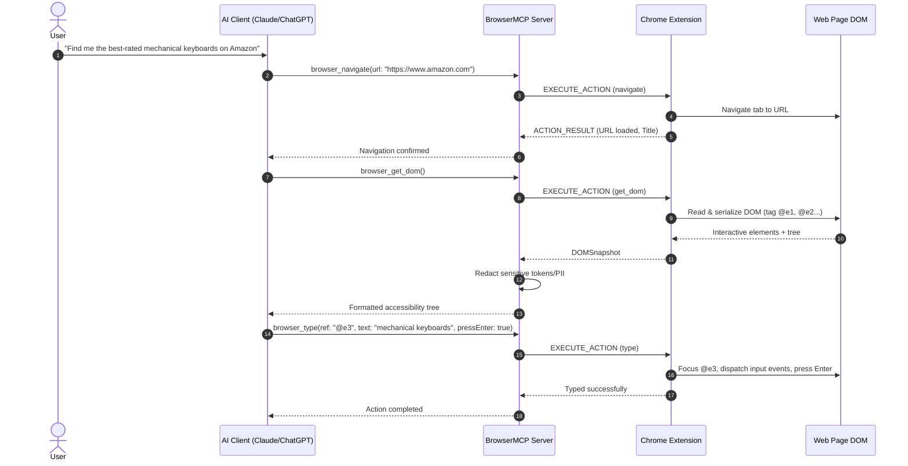

# BrowserMCP System Architecture & Design

## 1. Architectural Philosophy

BrowserMCP is engineered under a strict **Local-First, Zero-Cloud-Relay** principle. The AI is the cognitive decision maker; BrowserMCP provides the sensory inputs (DOM tree, text, screenshots) and motor outputs (click, type, scroll, tab management).

Unlike headless automation tools (Puppeteer / Playwright) that spin up isolated headless sessions without user authentication, cookies, or extensions, BrowserMCP operates **inside the user's authentic Google Chrome instance**. This allows AI clients to operate with existing session cookies, logins (Gmail, GitHub, LinkedIn, Jira), and extensions without requiring users to share passwords or session tokens with cloud AI providers.

```
                         ┌──────────────┐
                         │     USER     │
                         └──────┬───────┘
                                │
                                v
                  ┌────────────────────────┐
                  │      AI CLIENTS        │
                  │                        │
                  │ ChatGPT | Claude | ... │
                  └───────────┬────────────┘
                              │
                              │ MCP (stdio / SSE)
                              v
                  ┌────────────────────────┐
                  │    BROWSERMCP MCP      │
                  │        SERVER          │
                  │                        │
                  │ Tools                  │
                  │ Permissions            │
                  │ Security               │
                  │ Tasks                  │
                  │ Logging                │
                  └───────────┬────────────┘
                              │
                              │ Secure Local Bridge (ws://127.0.0.1:19999)
                              v
                  ┌────────────────────────┐
                  │    CHROME EXTENSION    │
                  │                        │
                  │ DOM Reader             │
                  │ Element Finder         │
                  │ Action Executor        │
                  │ Tab Manager            │
                  │ Permission Manager     │
                  │ Approval System        │
                  └───────────┬────────────┘
                              │
                              v
                  ┌────────────────────────┐
                  │         CHROME         │
                  │                        │
                  │ Google                 │
                  │ LinkedIn               │
                  │ Gmail                  │
                  │ Amazon                 │
                  │ Other permitted sites  │
                  └────────────────────────┘
```

---

## 2. Core Components

### 2.1 MCP Server (`apps/mcp-server`)
- Exposes standard Model Context Protocol (MCP) tool endpoints.
- Runs natively on the host OS via `stdio` (compatible with Claude Desktop, Cursor, and any MCP client).
- Hosts the local WebSocket Bridge Server on `127.0.0.1:19999`.
- Enforces origin validation, token verification, and action rate limiting.
- Redacts PII, passwords, and private tokens from DOM snapshots before returning them to the LLM.

### 2.2 Secure Local Browser Bridge
- Bi-directional, low-latency WebSocket connection.
- Handshake involves exchanging a persistent cryptographic pairing token stored securely in `~/.browser-mcp/token.json` and Chrome's `chrome.storage.local`.
- Request-Response correlation via UUID `requestId` matching.
- Automatic reconnection with exponential backoff.

### 2.3 Chrome Extension (Manifest V3)
- **Background Service Worker**:
  - Maintains persistent connection to the bridge.
  - Controls tab lifecycle (`chrome.tabs`, `chrome.windows`).
  - Captures viewport screenshots via `chrome.tabs.captureVisibleTab`.
  - Injects and routes messages to content scripts.
- **Content Script**:
  - **DOM Reader**: Traverses live DOM, detects visibility, filters noise (styles, scripts), tags interactive elements with compact references (`@e1`, `@e2`), and constructs a token-optimized semantic tree.
  - **Element Finder**: Resolves elements using ref ID (`@e1`), CSS selectors, text, or ARIA roles.
  - **Action Executor**: Dispatches authentic user events (`pointerdown`, `mousedown`, `focus`, `input`, `change`, `click`, `keydown`).
  - **Overlay HUD**: Renders on-page operation status and interactive approval modals for high-risk actions.
- **Popup & Options UI**:
  - User-friendly configuration of security modes (Strict, Moderate, Unrestricted), token pairing, domain allowlists/blocklists.

---

## 3. Communication Sequence


